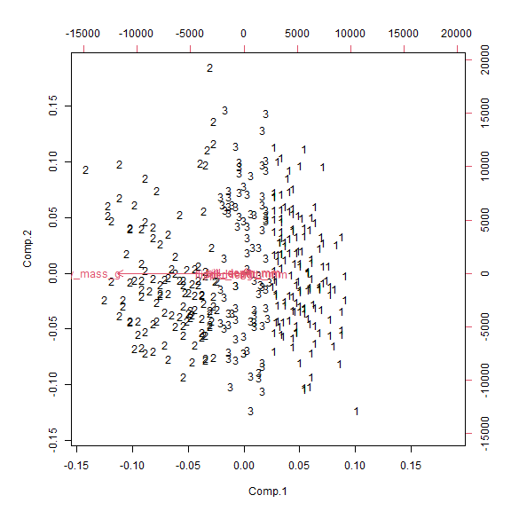
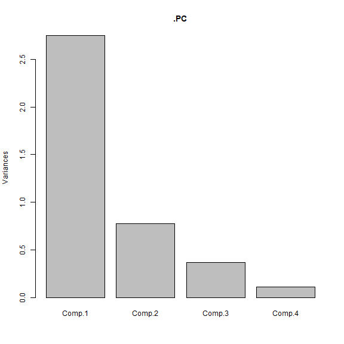
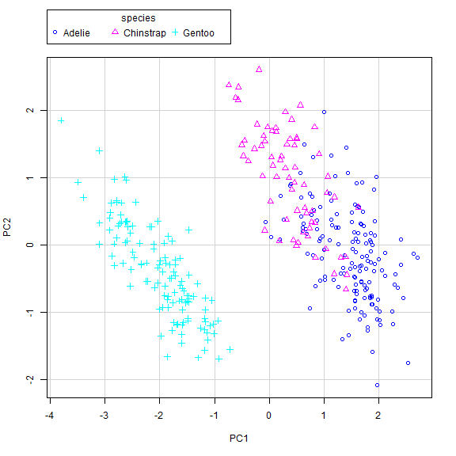

<!-- R Commander Markdown Template -->

Replace with Main Title
=======================

### MKHIGGI

### 2024-03-18


```r
> data()
```


### Table of Summary Statistics: bill_depth_mm, bill_length_mm, body_mass_g, flipper_length_mm

```r
> # Table for bill_depth_mm:
> Tapply(bill_depth_mm ~ species, mean, na.action=na.omit, data=penguins) 
```

```
   Adelie Chinstrap    Gentoo 
 18.34636  18.42059  14.98211 
```

```r
>   # mean by groups
> # Table for bill_length_mm:
> Tapply(bill_length_mm ~ species, mean, na.action=na.omit, data=penguins) 
```

```
   Adelie Chinstrap    Gentoo 
 38.79139  48.83382  47.50488 
```

```r
>   # mean by groups
> # Table for body_mass_g:
> Tapply(body_mass_g ~ species, mean, na.action=na.omit, data=penguins) 
```

```
   Adelie Chinstrap    Gentoo 
 3700.662  3733.088  5076.016 
```

```r
>   # mean by groups
> # Table for flipper_length_mm:
> Tapply(flipper_length_mm ~ species, mean, na.action=na.omit, data=penguins) 
```

```
   Adelie Chinstrap    Gentoo 
 189.9536  195.8235  217.1870 
```

```r
>   # mean by groups
```


```r
> library(abind, pos=18)
```


### Two-Way Contingency Table: species, island

```r
> local({
+   .Table <- xtabs(~species+island, data=penguins)
+   cat("\nFrequency table:\n")
+   print(.Table)
+   .Test <- chisq.test(.Table, correct=FALSE)
+   print(.Test)
+ })
```

```

Frequency table:
           island
species     Biscoe Dream Torgersen
  Adelie        44    56        52
  Chinstrap      0    68         0
  Gentoo       124     0         0

	Pearson's Chi-squared test

data:  .Table
X-squared = 299.55, df = 4, p-value < 2.2e-16
```


### Hiearchical Cluster Analysis: bill_depth_mm, bill_length_mm, body_mass_g, flipper_length_mm

```r
> HClust.1 <- hclust(dist(model.matrix(~-1 + 
+   bill_depth_mm+bill_length_mm+body_mass_g+flipper_length_mm, penguins)) , 
+   method= "ward")
```

```
The "ward" method has been renamed to "ward.D"; note new "ward.D2"
```

```r
> plot(HClust.1, main= "Cluster Dendrogram for Solution HClust.1", xlab= 
+   "Observation Number in Data Set penguins", 
+   sub="Method=ward; Distance=euclidian")
```

<div class="figure">

<p class="caption">plot of chunk unnamed-chunk-6</p>
</div>


```r
> summary(as.factor(cutree(HClust.1, k = 3))) # Cluster Sizes
```

```
  1   2   3 
142 115  85 
```

```r
> by(model.matrix(~-1 + bill_depth_mm + bill_length_mm + body_mass_g + 
+   flipper_length_mm, penguins), as.factor(cutree(HClust.1, k = 3)), colMeans) 
```

```
INDICES: 1
    bill_depth_mm    bill_length_mm       body_mass_g flipper_length_mm 
         17.93732          40.95282        3452.81690         189.35915 
------------------------------------------------------------ 
INDICES: 2
    bill_depth_mm    bill_length_mm       body_mass_g flipper_length_mm 
         15.48522          47.61304        5159.13043         216.56522 
------------------------------------------------------------ 
INDICES: 3
    bill_depth_mm    bill_length_mm       body_mass_g flipper_length_mm 
         18.09176          43.88824        4157.64706         199.04706 
```

```r
>   # Cluster Centroids
> biplot(princomp(model.matrix(~-1 + bill_depth_mm + bill_length_mm + 
+   body_mass_g + flipper_length_mm, penguins)), xlabs = 
+   as.character(cutree(HClust.1, k = 3)))
```

<div class="figure">

<p class="caption">plot of chunk unnamed-chunk-7</p>
</div>


```r
> penguins$hclus.label <- assignCluster(model.matrix(~-1 + bill_depth_mm + 
+   bill_length_mm + body_mass_g + flipper_length_mm, penguins), penguins, 
+   cutree(HClust.1, k = 3))
```


### Two-Way Contingency Table: species, hclus.label

```r
> local({
+   .Table <- xtabs(~species+hclus.label, data=penguins)
+   cat("\nFrequency table:\n")
+   print(.Table)
+   .Test <- chisq.test(.Table, correct=FALSE)
+   print(.Test)
+ })
```

```

Frequency table:
           hclus.label
species       1   2   3
  Adelie     97   7  47
  Chinstrap  45   2  21
  Gentoo      0 106  17

	Pearson's Chi-squared test

data:  .Table
X-squared = 247.01, df = 4, p-value < 2.2e-16
```


### Principal-Components Analysis: bill_depth_mm, bill_length_mm, body_mass_g, flipper_length_mm

```r
> local({
+   .PC <- 
+   princomp(~bill_depth_mm+bill_length_mm+body_mass_g+flipper_length_mm, 
+   cor=TRUE, data=penguins)
+   cat("\nComponent loadings:\n")
+   print(unclass(loadings(.PC)))
+   cat("\nComponent variances:\n")
+   print(.PC$sd^2)
+   cat("\n")
+   print(summary(.PC))
+   screeplot(.PC)
+   penguins <<- within(penguins, {
+     PC2 <- .PC$scores[,2]
+     PC1 <- .PC$scores[,1]
+   })
+ })
```

```

Component loadings:
                      Comp.1      Comp.2     Comp.3     Comp.4
bill_depth_mm      0.4003347 0.797766572  0.4184272  0.1679860
bill_length_mm    -0.4552503 0.597031143 -0.6443012 -0.1455231
body_mass_g       -0.5483502 0.084362920  0.5966001 -0.5798821
flipper_length_mm -0.5760133 0.002282201  0.2320840  0.7837987

Component variances:
   Comp.1    Comp.2    Comp.3    Comp.4 
2.7537551 0.7725168 0.3652359 0.1084922 

Importance of components:
                          Comp.1    Comp.2     Comp.3     Comp.4
Standard deviation     1.6594442 0.8789293 0.60434750 0.32938157
Proportion of Variance 0.6884388 0.1931292 0.09130898 0.02712305
Cumulative Proportion  0.6884388 0.8815680 0.97287695 1.00000000
```

<div class="figure">

<p class="caption">plot of chunk unnamed-chunk-10</p>
</div>


### Scatterplot: PC2~PC1 | species

```r
> scatterplot(PC2~PC1 | species, regLine=FALSE, smooth=FALSE, boxplots=FALSE, 
+   by.groups=TRUE, data=penguins)
```

<div class="figure">

<p class="caption">plot of chunk unnamed-chunk-11</p>
</div>


